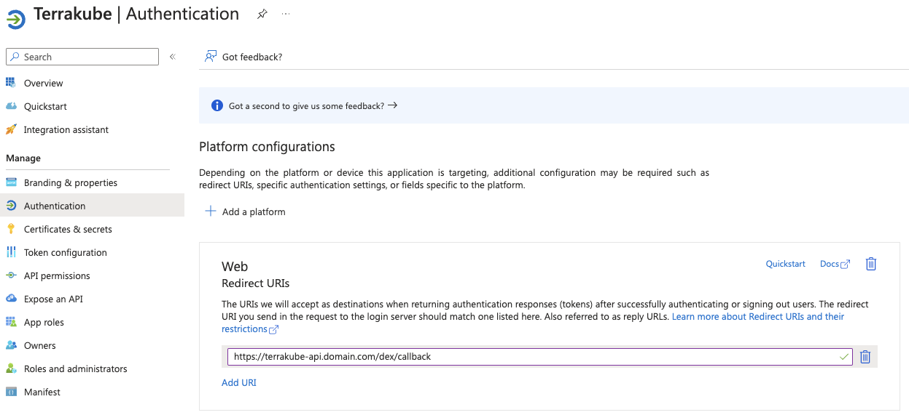

## installing NGINX and Cert-Manager on an AKS Cluster

This document outlines the steps for installing NGINX Ingress Controller and Cert-Manager for automatic certificate management on an Azure Kubernetes Service (AKS) cluster.

### Prerequisites:

- Existing AKS cluster
- DNS provider such as Azure DNS or OVH (optional)

### Installation:

. *NGINX Ingress Controller Deployment:*

Use Helm to deploy the NGINX Ingress Controller. You can find the appropriate chart information from the official NGINX Ingress Controller project on [Nginx docs](https://docs.nginx.com/nginx-ingress-controller/installation/installing-nic/installation-with-helm/).

```hcl
resource "helm_release" "ingress_nginx" {
  name             = "ingress-nginx"
  repository       = "https://kubernetes.github.io/ingress-nginx"
  chart            = "ingress-nginx"
  namespace        = "ingress"
  create_namespace = true
  atomic           = true
  values           = ["${file("ingress.yaml")}"]
}
```

and the chart config:

```yaml
controller:
  allowSnippetAnnotations: true
  service:
    annotations:
      service.beta.kubernetes.io/azure-load-balancer-health-probe-request-path: /healthz
```

. *Cert-Manager Deployment:*

Deploy Cert-Manager using Helm:

```hcl
resource "helm_release" "cert_manager" {
  name             = "cert-manager"
  namespace        = "cert-manager"
  repository       = "https://charts.jetstack.io"
  chart            = "cert-manager"
  create_namespace = true
  atomic           = true

  # Add any additional configuration values
  set {
    name  = "installCRDs"
    value = "true"
  }

  # Wait for the resources to be ready
  wait = true

  # Configure dependencies
  depends_on = [helm_release.ingress_nginx]
}
```

adding required resources to create a cluster issuer:

a private key and certificate, the base files can be created with openssl:

```sh
openssl req -x509 -nodes -days 365 -newkey rsa:2048 -keyout tls.key -out tls.crt -subj "/CN=domain.com"
```

then we add them with terraform to the cluster:

```hcl
resource "kubernetes_secret" "letsencrypt_private_key" {
  metadata {
    name      = "letsencrypt-private-key"
    namespace = "cert-manager"
  }

  data = {
    "tls.key" = "${file("tls.key")}"
    "tls.crt" = "${file("tls.crt")}"
  }

  type = "kubernetes.io/tls"
}
```

in the case of using ovh:

```sh
git clone https://github.com/baarde/cert-manager-webhook-ovh.git
cd cert-manager-webhook-ovh
helm install cert-manager-webhook-ovh ./deploy/cert-manager-webhook-ovh --set groupName='<GROUP_NAME>'
```

```hcl
resource "kubernetes_secret" "ovh_credentials" {
  metadata {
    name      = "ovh-credentials"
    namespace = "cert-manager"
  }

  data = {
    "application-secret" = var.ovh_application_secret
  }
}

resource "kubernetes_manifest" "letsencrypt_cluster_issuer" {
  depends_on = [helm_release.cert_manager]
  manifest = {
    "apiVersion" = "cert-manager.io/v1"
    "kind"       = "ClusterIssuer"
    "metadata" = {
      "name" = "letsencrypt"
    }
    "spec" = {
      "acme" = {
        "email"  = var.acme_email
        "server" = "https://acme-v02.api.letsencrypt.org/directory"
        "privateKeySecretRef" = {
          "name" = kubernetes_secret.letsencrypt_private_key.metadata.0.name
        }
        "solvers" = [
          {
            "dns01" = {
              "webhook" = {
                "groupName"  = '<GROUP_NAME>'
                "solverName" = "ovh"
                "config" = {
                  "endpoint"       = "ovh-eu"
                  "applicationKey" = var.ovh_application_key
                  "applicationSecretRef" = {
                    "name" = kubernetes_secret.ovh_credentials.metadata.0.name
                    "key"  = "application-secret"
                  }
                  "consumerKey" = var.ovh_consumer_key
                }
              }
            }
          }
        ]
      }
    }
  }
}
```

## Installing Terrakube

To install terrakube you can use one of the examples provided by in the docs:

```hcl
resource "helm_release" "terrakube" {
  name             = "terrakube"
  chart            = "terrakube"
  repository       = "https://AzBuilder.github.io/terrakube-helm-chart"
  namespace        = "terrakube"
  create_namespace = true
  atomic           = true
  values = [
    "${file("values.yaml")}"
  ]
}
```

The Auth examples can be found [here](https://github.com/AzBuilder/terrakube-helm-chart/tree/main/examples).

## Azure entra-id auth for Terrakube

you need an app regestration to proceed with these steps.

> [!NOTE]  
> You can create an app regestration on azure following this doc
> [Quickstart: Register an application with the Microsoft identity platform](https://learn.microsoft.com/en-us/entra/identity-platform/quickstart-register-app)

You need to set the redirect URI **Platform configurations** in the app regestration that will be used to establish auth between terrakube dex client and Entra-ID



Then you only need a couple values:
- Tennant ID
- Client ID 
- Client secret (you'll need to generate one in the app-regestration)

Update the Values.yaml that create terrakube deployment:

```yaml
security:
  adminGroup: "<<CHANGE THIS>>" # This should be your Entra ID team the format is OrganizationName:TeamName
  patSecret: "<<CHANGE THIS>>"  # Sample Key 32 characters z6QHX!y@Nep2QDT!53vgH43^PjRXyC3X
  internalSecret: "<<CHANGE THIS>>" # Sample Key 32 characters Kb^8cMerPNZV6hS!9!kcD*KuUPUBa^B3
  dexClientId: "microsoft"
  dexClientScope: "email openid profile offline_access groups"

dex:
  enabled: true
  config:
    issuer: https://terrakube-api.domain.com/dex
    storage:
      type: memory
    oauth2:
      responseTypes: ["code", "token", "id_token"]
      skipApprovalScreen: true
    web:
      allowedOrigins: ["*"]
    staticClients:
    - id: microsoft
      redirectURIs:
      - 'https://terrakube-ui.domain.com'
      - 'http://localhost:10001/login'
      - 'http://localhost:10000/login'
      - '/device/callback'
      name: 'microsoft'
      public: true
    connectors:
    - type: microsoft
      id: microsoft
      name: microsoft
      config:
        clientID: "app-regestration-client-id"
        clientSecret: "app-regestration-client-secret"
        redirectURI: "https://terrakube-api.domain.com/dex/callback"
        tenant: "app-regestration-tennat-id"

ingress:
  useTls: true
  ui:
    enabled: true
    domain: "terrakube-ui.domain.com" # Change for your real domain
    path: "/(.*)"
    pathType: "Prefix"
    annotations:
      kubernetes.io/ingress.class: nginx
      nginx.ingress.kubernetes.io/use-regex: "true"
      cert-manager.io/cluster-issuer: letsencrypt
  api:
    enabled: true
    domain: "terrakube-api.domain.com" # Change for your real domain
    path: "/(.*)"
    pathType: "Prefix"
    annotations:
      kubernetes.io/ingress.class: nginx
      nginx.ingress.kubernetes.io/use-regex: "true"
      nginx.ingress.kubernetes.io/configuration-snippet: "proxy_set_header Authorization $http_authorization;"
      cert-manager.io/cluster-issuer: letsencrypt
  registry:
    enabled: true
    domain: "terrakube-reg.domain.com" # Change for your real domain
    path: "/(.*)"
    pathType: "Prefix"
    annotations:
      kubernetes.io/ingress.class: nginx
      nginx.ingress.kubernetes.io/use-regex: "true"
      nginx.ingress.kubernetes.io/configuration-snippet: "proxy_set_header Authorization $http_authorization;"
      cert-manager.io/cluster-issuer: letsencrypt
  dex:
    enabled: true
    path: "/dex/(.*)"
    pathType: "Prefix"
    annotations:
      kubernetes.io/ingress.class: nginx
      nginx.ingress.kubernetes.io/use-regex: "true"
      nginx.ingress.kubernetes.io/configuration-snippet: "proxy_set_header Authorization $http_authorization;"
      cert-manager.io/cluster-issuer: letsencrypt
```